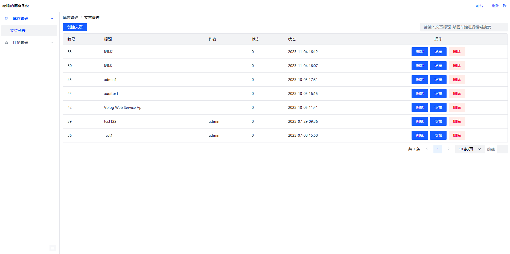
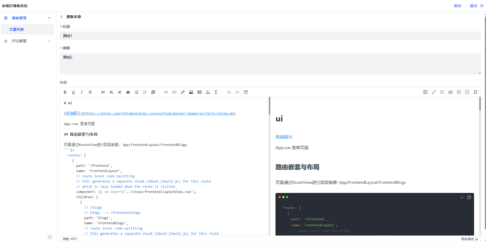
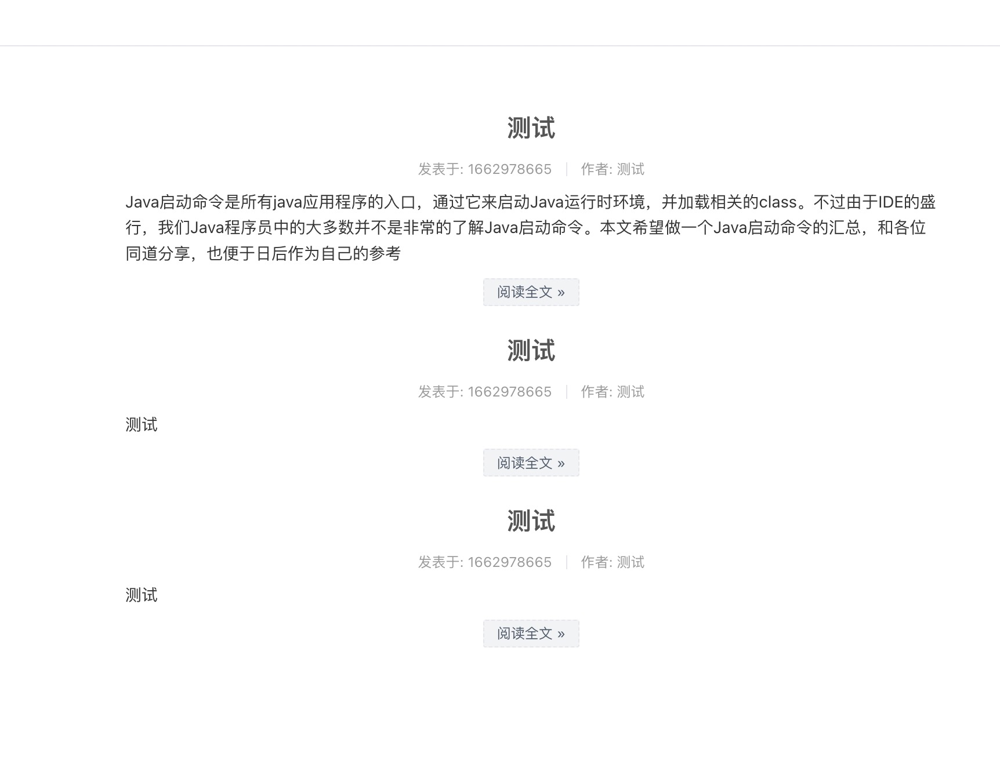
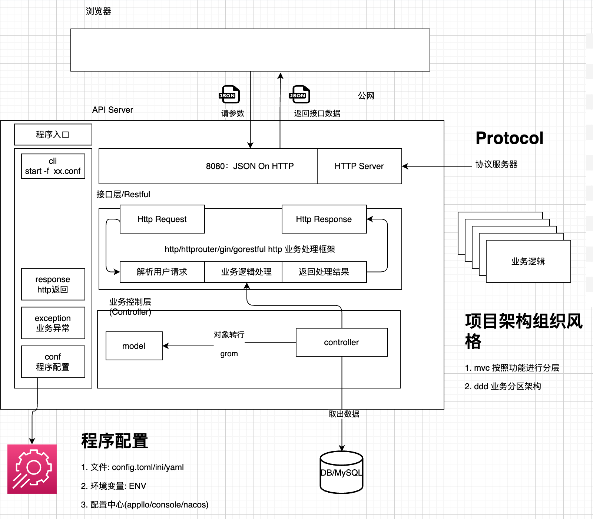
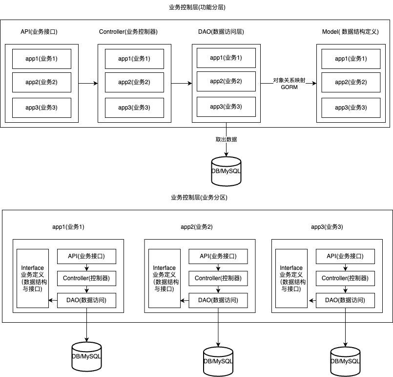
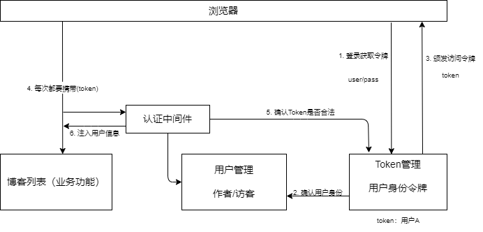

# Web全站开发（Vblog）

## 需求

博客编写与发布

目标用户：
+ 文章管理员（作者）：写博客的后台
+ 访客：浏览文章的前台

## 原型

### 博客后台（作者）

1. 列表页



2. 编辑页




### 博客前台（访客）

博客浏览页


## 架构设计

### 整体架构


### 业务代码风格


### 项目编写流程

+ 整体框架（上-->下）
+ 业务代码（下-->上）

1. 顶层设计（上-->下）
2. 业务代码：从下往上写，核心应该关心业务的实现

### 项目结构
```sh
go mod init "github.com/yyyyff/go_study/tree/main/vblog"
```

+ main.go: 入口文件
+ conf: 程序的配置处理
+ exception: 业务自定义异常 （token过期等）
+ response: 请求返回的统一数据格式 : {"code": 0, "msg": ""}
+ protocol: 协议服务器
+ apps: 业务模块开发区域

### 业务模块



+ 博客管理（Blog）
+ 用户管理（User）
+ 令牌管理（Token）
